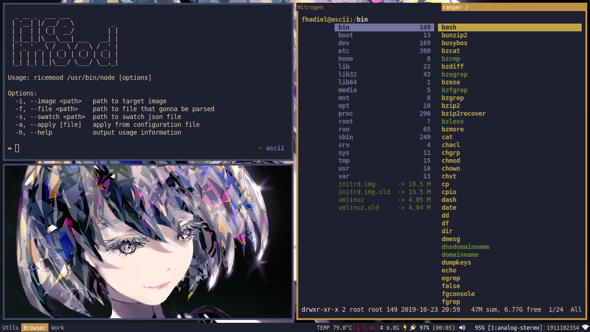
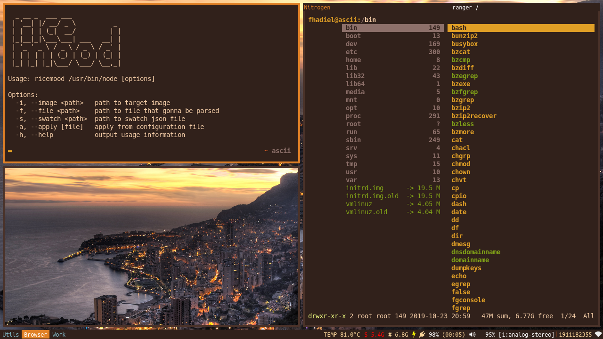

# ricemood
> this tool is not plug and play.

The purpose of this tool is to match your color scheme with your wallpaper.

How this work?  
in regular configuration file you write color like this:  
```color0 #FFFFFF```  

ricemood take file containing something like this:  
```color0 ^r@Vibrant>lighten(10)^```  
parse that file and overwrite the original configuration file

With help of these amazing library:
 * [node-vibrant](https://github.com/akfish/node-vibrant) for generating very meaningful colors from an image
  * [color](https://github.com/Qix-/color) for providing functions to filter colors

## Quick Link > [Example File](sample/)

## Installation : ```npm install -g ricemood```  
You can set it to your :

1. i3 config
2. terminal color scheme
3. svg icon file
4. The possibility are endless!



```
       _
      (_)
  _ __ _  ___ ___
 | '__| |/ __/ _ \          _
 | |  | | (_|  __/         | |
 |_|__|_|\___\___| ___   __| |
 | '_ ' _ \ / _ \ / _ \ / _' |
 | | | | | | (_) | (_) | (_| |
 |_| |_| |_|\___/ \___/ \__,_|

Usage: ricemood [options]

Options:
  -i, --image <path>   path to target image
  -f, --file <path>    path to file that gonna be parsed 
  -s, --swatch <path>  path to swatch json file 
  -a, --apply [file]   apply from configuration file
  -h, --help           output usage information
```
```
Opening tag : ^r  
Closing tag : ^
```


## Function symbol

| symbol | description                  | example                       |
| ------ | ---------------------------- | ----------------------------- |
| @      | Choose color                 | @Vibrant                      |
| >      | Pipe color to various filter | @Vibrant>lighten(0.2)>sa(0.5) |
| #      | Choose color output          | @Vibrant#rgb, @Vibrant#r      |

## Color Name List

> Prefix : **@**

---

| alias | full         |
| ----- | ------------ |
| V     | Vibrant      |
| LV    | LightVibrant |
| DV    | DarkVibrant  |
| M     | Muted        |
| LM    | LightMuted   |
| DM    | DarkMuted    |

## Pipe / Chaining

> Symbol : **>**

| alias | description          | default parameter |
| ----- | -------------------- | ----------------- |
| ge    | grayscale            | No param          |
| ne    | negate               | No param          |
| ttc   | get title text color | No param          |
| btc   | get body text color  | No param          |
| da    | darken               | 0.5               |
| li    | lighten              | 0.5               |
| de    | desaturate           | 0.5               |
| sa    | saturate             | 0.5               |
| wh    | whiten               | 0.5               |
| bl    | blacken              | 0.5               |
| fa    | fade                 | 0.5               |
| op    | opaquer              | 0.5               |
| ro    | rotate               | 90                |
| r     | red                  | 255               |
| g     | green                | 255               |
| b     | blue                 | 255               |
| h     | hue                  | 255               |
| s     | saturationl          | 255               |
| l     | lightness            | 255               |

## Color Format

| format | example output | parameter | default |
| ------ | -------------- | --------- | ------- |
|        | #FFFFFF        | none      |
| hex    | FFFFFF         | None      |
| rgb    | 255,255,255    | separator | ,       |
| hsl    | 255,255,255    | separator | ,       |
| r/g/b  | 255            | None      |
| h/s/l  | 255            | None      |

## Screenshots

These screenshots have the same configuration file




```
